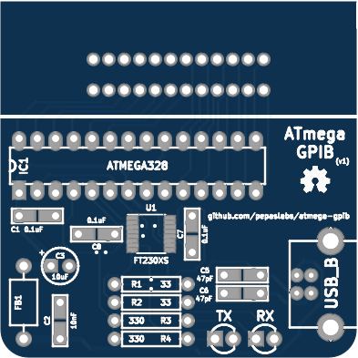
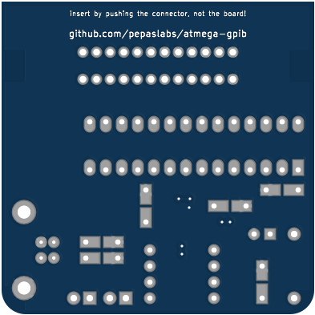

# atmega-gpib
An ATmega-based GPIB-to-USB adapter board.

# Status

This board is untested.

# Board design v1

Initial board design.

## Gerbers

[gerbers.zip](kicad/releases/v1/gerbers.zip)

## Schematic

[PDF](kicad/releases/v1/atmega-gpib-schematic.pdf).

# License

This board design is [Open-Source Hardware](http://www.oshwa.org/definition/).  It is licensed under the [MIT License](http://opensource.org/licenses/MIT).  It was designed by Jason Pepas.

# Thanks

Thanks to [Steven Casagrande](http://steven.casagrande.io/) of [Galvant Industries](https://github.com/Galvant) for [releasing](https://github.com/Galvant/gpibusb-pcb) his [GPIB-to-USB adapter](http://www.galvant.ca/) as open source hardware.  Using a few of his KiCAD footprints saved me a lot of time!
